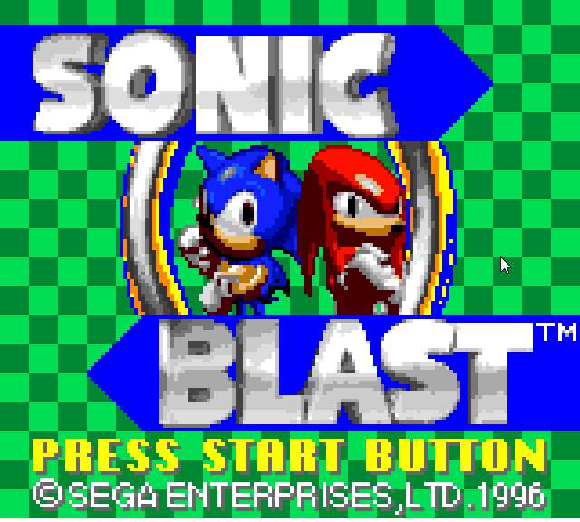
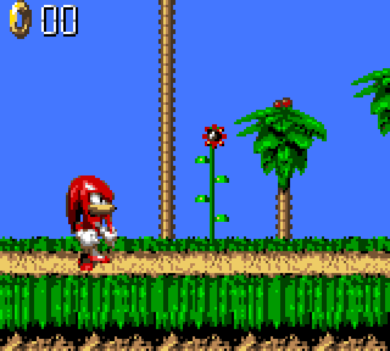

# SonicBlastGGRecomp

Static recompilation of *Sonic Blast* (Sega Game Gear, 1996) into native C,
using the [smsggrecomp](https://github.com/mstan/smsggrecomp) framework. This
repo is the per-game side: the `game.toml`, the build glue, and a pre-built
release. The ROM and the generated C are **not** here — you supply your own
legally-dumped ROM and regenerate locally.

## What "static recompilation" means here

The game's Z80 machine code is translated **ahead of time** into C and compiled
to a native binary — it is not interpreted at runtime. The rest of the Game Gear
(VDP with the GG palette/viewport, SN76489 stereo sound, controller/system
ports, the Sega mapper) is modeled by the
[smsggrecomp](https://github.com/mstan/smsggrecomp) runtime. Computed jumps the
static analysis can't resolve fall back to a bundled Z80 interpreter over the
live bus. You supply your own legally-dumped copy of the ROM; it is **never**
redistributed here.

## Status

> **v0.0.2 — early pre-release. Expect bugs.**
> Across the title and attract-demo sequence we exercised (~60s), the build runs
> entirely as recompiled native code (no interpreter-fallback dispatch miss was
> hit on that path) and renders byte-exact to the superzazu interpreter oracle on
> palette (CRAM) and system RAM. The game has **not** been played end to end:
> coverage across full gameplay is unverified, and more code paths will surface
> during real play (the built-in interpreter fallback handles them when they do).

## Screenshots

Recompiled native build (no emulator), captured running the .gg ROM:

| Title | Gameplay |
|---|---|
|  |  |

## Quick start (pre-built release)

1. Download `SonicBlastGGRecomp-windows-x64.zip` from
   [Releases](../../releases) and unzip it (keep `SDL2.dll` next to the `.exe`).
2. Supply your own legally-obtained *Sonic Blast (Game Gear)* ROM (`.gg`).
3. Run it with your ROM:
   ```
   SonicBlastGGRecomp.exe path\to\sonicblast.gg --window 4
   ```

## Controls

| Key | Action |
|-----|--------|
| Arrow keys | D-pad |
| Z | Button 1 (jump) |
| X | Button 2 |
| Enter | Start |
| Esc | Quit |

## ROM

| Field | Value |
|-------|-------|
| Title | Sonic Blast (Game Gear) |
| Region | GG Export |
| CRC32 | `0x031B9DA9` |
| Size | 1 MB |

The ROM is **never** redistributed — supply your own legally-dumped copy.

## Building from source

Requires the [smsggrecomp](https://github.com/mstan/smsggrecomp) engine checked
out as a sibling directory (`../smsggrecomp`) at the commit in `smsggrecomp.pin`,
its recompiler built (`recompiler/build/SmsRecomp.exe`), plus MinGW `gcc` and
SDL2 (MSYS2 `mingw64`).

```powershell
# from this repo, with your ROM present and ../smsggrecomp built:
powershell -File build.ps1            # regenerates the C from your ROM, then builds the windowed exe
```

The recompiler reads `game.toml`, writes `generated/<prefix>_{full,dispatch,layout}.c`
(gitignored — a derivative of the ROM), and `build.ps1` compiles those plus the
shared runner into `SonicBlastGGRecomp.exe`.

## Repo layout

| Path | Purpose |
|------|---------|
| `game.toml` | Per-game config: ROM identity, mapper, RAM layout, discovery seeds, jump tables. |
| `build.ps1` | Regenerate from your ROM + build the windowed exe. |
| `smsggrecomp.pin` | The engine commit this game was verified against. |
| `generated/` | Recompiler output (gitignored; regenerated from your ROM). |

## License

Not yet declared. Code in this repo is original. The *Sonic Blast* ROM and any
data derived from it are **not** in this repo and are not licensed for
redistribution.

---

<p align="center">
  <sub><b>R.A.I.D. — Retro AI Development</b> · a Discord for AI-assisted retro reverse-engineering, decomp &amp; recomp</sub>
</p>

<p align="center">
  <a href="https://discord.gg/Ad9BwSzctP"></a>
</p>
